# 🚀 DevOps Practical Assessment — Submission

<div align="center">

**Student:** Harisuryaprakash Reddy PNV  
**GitHub:** [@pnvharisuryaprakashreddy](https://github.com/pnvharisuryaprakashreddy)  
**Date:** July 2026

---


</div>

---

## 📋 Table of Contents

- [Question 1 — Linux](#-question-1--linux-10-marks)
- [Question 2 — Git](#-question-2--git-20-marks)
- [Question 3 — GitHub](#-question-3--github-30-marks)
- [Question 4 — Docker](#-question-4--docker-40-marks)
- [Important Links](#-important-links)

---

## 🐧 Question 1 — Linux (10 marks)

> All tasks performed in the terminal. The folder `devops-test/` was created in the home directory and used throughout.

---

### Task 1a — Navigate to Home Directory & Print Full Path

**Command used:** `cd ~` then `pwd`

The `pwd` command prints the absolute path of the current directory. After navigating to the home directory with `cd ~`, it confirms the home path.

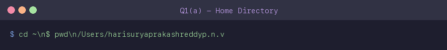

---

### Task 1b — Create Folder Structure `devops-test/scripts/` and `devops-test/logs/`

**Commands used:** `mkdir -p devops-test/scripts` and `mkdir -p devops-test/logs`

The `-p` flag ensures all parent directories are created in one command. `find devops-test -type d` is used to verify the structure.

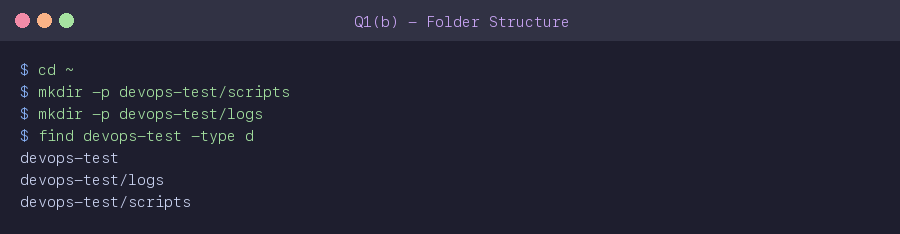

---

### Task 1c — Create `setup.sh` with Content & Display

**Commands used:** `nano setup.sh` → added `echo 'DevOps Bootcamp'` → saved → `cat setup.sh`

A shell script `setup.sh` was created inside `devops-test/scripts/` using nano. The file contains a single line that prints *DevOps Bootcamp* when executed.

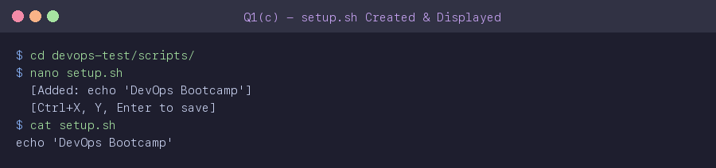

---

### Task 1d — Create a Hidden File with Content

**Command used:** `nano .hidden_file` → added `I am hidden.` → saved → `cat .hidden_file`

Hidden files in Linux start with a `.` prefix. The file `.hidden_file` was created inside `devops-test/` with the content `I am hidden.`

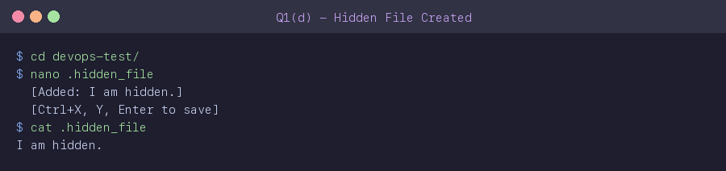

---

### Task 1e — List All Files with Hidden, Sizes & Permissions

**Command used:** `ls -lah`

- `-l` → long listing format (permissions, owner, size)  
- `-a` → show hidden files (starting with `.`)  
- `-h` → human-readable file sizes

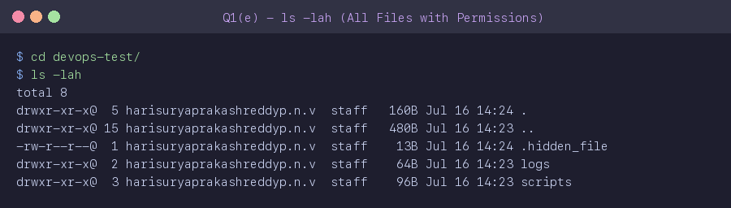

---

### Task 1f — Create an Empty File in `logs/`

**Command used:** `touch empty.log`

The `touch` command creates an empty file without any content. The file was created inside `devops-test/logs/` and verified with `ls -lah`.

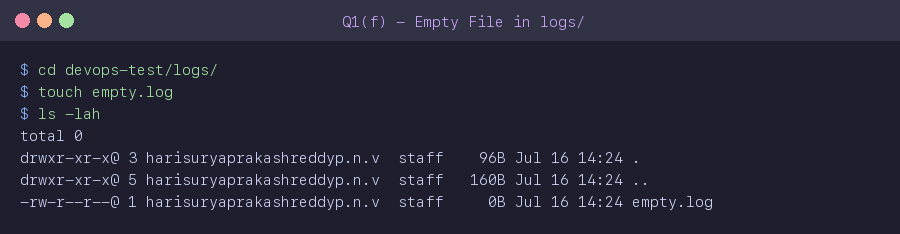

---

### Task 1g — Delete `logs/` Directory & Confirm

**Commands used:** `rm -rf logs/` → `ls logs/` (confirms not found) → `ls`

`rm -rf` forcefully removes the directory and all its contents. The subsequent `ls` command confirms `logs/` no longer exists.

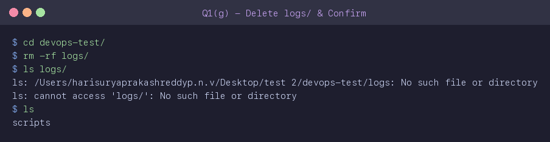

---

## 🔧 Question 2 — Git (20 marks)

> All Git tasks were performed inside the `devops-test/` folder created in Question 1.

---

### Task 2a — Initialize Git Repository

**Command used:** `git init` then `ls -la .git`

`git init` creates a new local Git repository by initialising a `.git/` folder. The `ls -la .git` command verifies that the repository was successfully created.

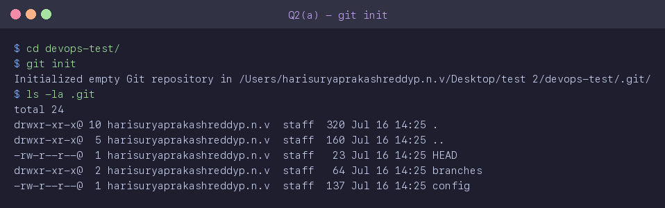

---

### Task 2b — Configure Git Name & Email

**Commands used:**
```bash
git config user.name "Harisuryaprakash Reddy PNV"
git config user.email "pnvharisuryaprakashreddy@gmail.com"
git config --list --local
```

Git user identity is set locally for this repository. `git config --list --local` shows the saved configuration to confirm it was stored correctly.

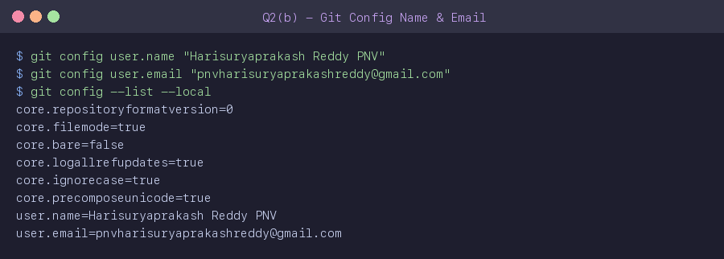

---

### Task 2c — Create `README.md` & Check `git status` Before/After

**Commands used:** `git status` → `nano README.md` → `git status`

`README.md` was created with:
```
# DevOps Test Project
Author: Harisuryaprakash Reddy PNV
```

The two `git status` outputs show: **before** (no files to track) → **after** (README.md shown as untracked).

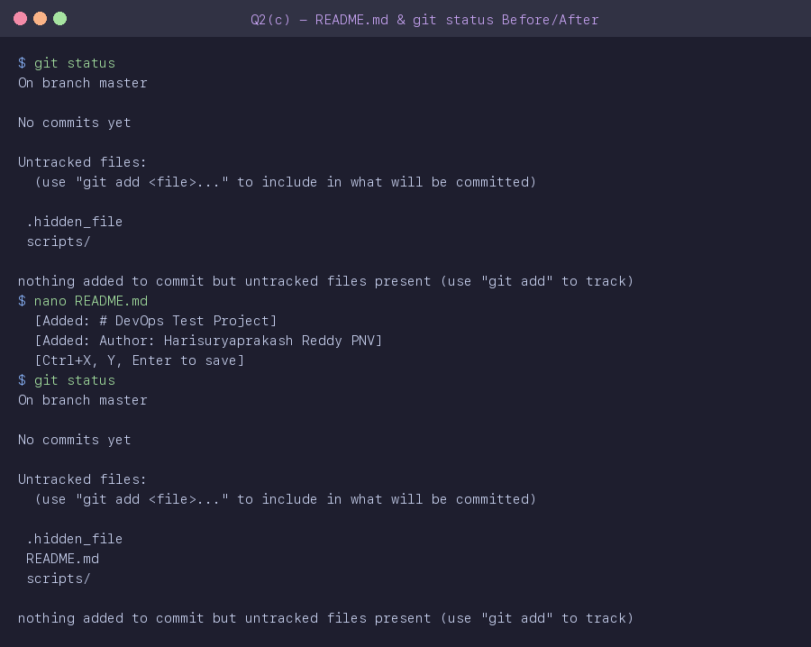

---

### Task 2d — Stage README.md & First Commit

**Commands used:**
```bash
git add README.md
git commit -m "feat: initial commit with README"
git log
```

Only `README.md` was staged using `git add`. The commit message follows the **conventional commits** format. `git log` confirms the commit was recorded.

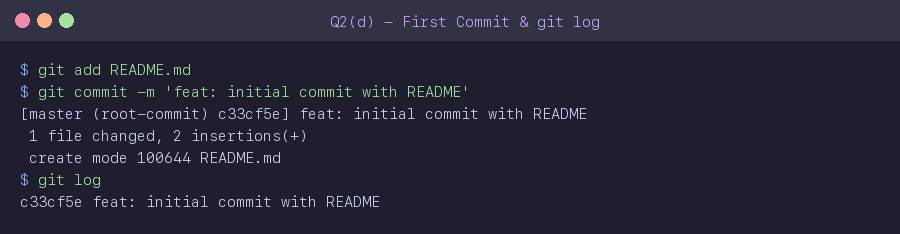

---

### Task 2e — Update README & Second Commit

**Commands used:**
```bash
echo "Status: Completed README.md." >> README.md
git add README.md
git commit -m "docs: update README status"
git log --oneline
```

A new line was appended to `README.md`. After staging and committing, `git log --oneline` shows a compact view of all commits so far.

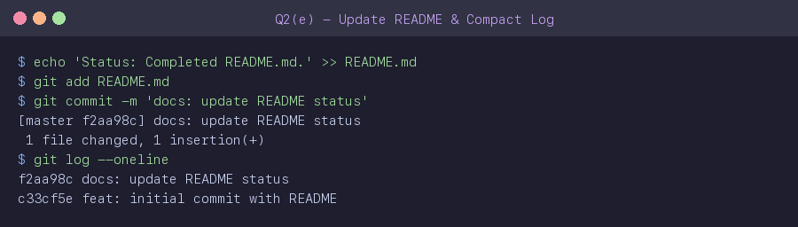

---

### Task 2f — Create `.gitignore` for `*.log` Files

**Commands used:**
```bash
nano .gitignore       # added: *.log
git add .gitignore
git commit -m "chore: added .gitignore"
```

A `.gitignore` file was created to exclude all files with the `.log` extension from being tracked by Git. This ensures log files are never accidentally committed.

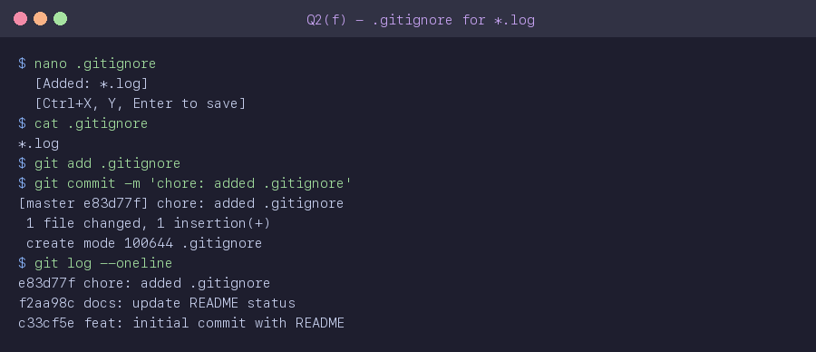

---

## 🐙 Question 3 — GitHub (30 marks)

> A public GitHub repository `devops-test` was created and linked to the local repository. A feature branch was created, a script committed, and a Pull Request was opened and merged.

---

### Task 3a — Create Public GitHub Repository

**Command used:** `gh repo create devops-test --public`

A new public repository named `devops-test` was created on GitHub using the GitHub CLI (`gh`). It was **not** initialised with a README to avoid conflicts with the local repo.

🔗 **Repo URL:** https://github.com/pnvharisuryaprakashreddy/devops-test

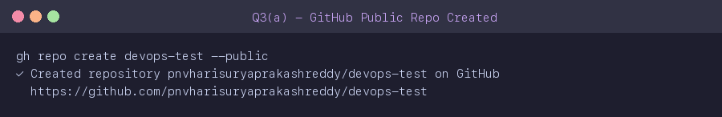

---

### Task 3b — Link Remote & Push to `main`

**Commands used:**
```bash
git remote add origin https://github.com/pnvharisuryaprakashreddy/devops-test.git
git branch -m master main
git push -u origin main
```

The local repository was linked to the GitHub remote. The default branch was renamed from `master` to `main`, then all local commits were pushed to GitHub.

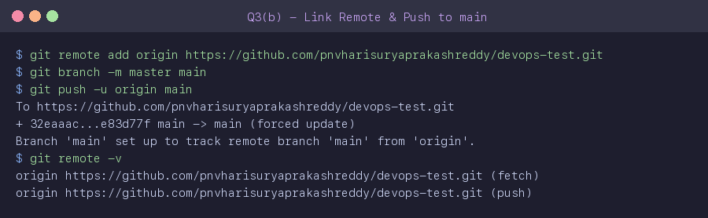

---

### Task 3c — Create & Switch to `feature-1` Branch

**Commands used:**
```bash
git checkout -b feature-1
git branch
```

`git checkout -b` creates a new branch and switches to it in a single command. `git branch` confirms the active branch is now `feature-1`.

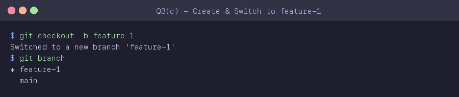

---

### Task 3d — Create `deploy.sh` & Commit on `feature-1`

**Commands used:**
```bash
nano scripts/deploy.sh
# Added:
# #!/bin/bash
# echo 'Deployment script'
git add scripts/deploy.sh
git commit -m "feat: add deploy script"
```

A deployment shell script was created in `scripts/deploy.sh` on the `feature-1` branch and committed.

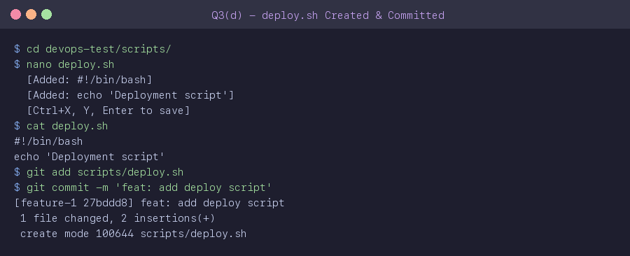

---

### Task 3e — Push Branch, Open PR & Merge

**Commands used:**
```bash
git push -u origin feature-1
gh pr create --base main --head feature-1 --title "Add deployment script"
gh pr merge 2 --merge
```

The `feature-1` branch was pushed to GitHub. A Pull Request was opened with title **"Add deployment script"** and then merged into `main` using the GitHub CLI.

🔗 **PR #2 (MERGED):** https://github.com/pnvharisuryaprakashreddy/devops-test/pull/2

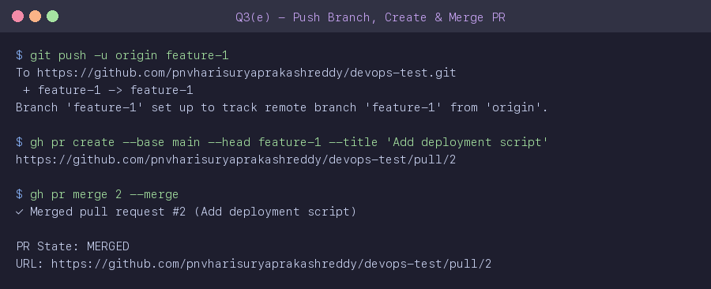

---

## 🐳 Question 4 — Docker (40 marks)

> Docker Desktop was running throughout. All tasks used the `docker` CLI.

---

### Task 4a — Pull `nginx:latest` & List Images

**Commands used:**
```bash
docker pull nginx:latest
docker images
```

The official `nginx:latest` image was pulled from Docker Hub. `docker images` lists all local images and confirms nginx was downloaded. **Image size: ~256 MB.**

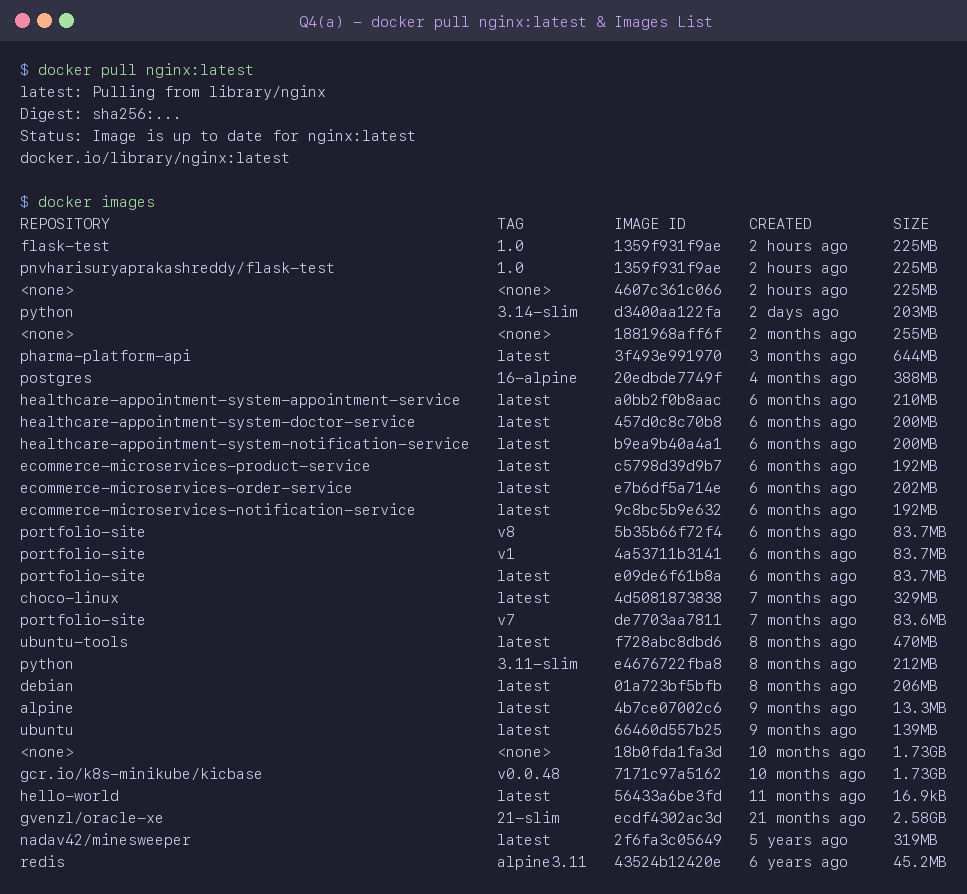

---

### Task 4b — Run `test-nginx` Container on Port 8090

**Commands used:**
```bash
docker run -d --name test-nginx -p 8090:80 nginx:latest
docker ps
```

- `-d` → detached (background) mode  
- `--name test-nginx` → named container  
- `-p 8090:80` → maps host port 8090 → container port 80

`docker ps` confirms the container is running.

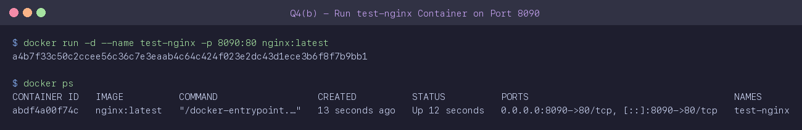

---

### Task 4c — Create `app.py` & `requirements.txt`

**Files created inside `devops-test/`:**

`app.py`:
```python
from flask import Flask
app = Flask(__name__)

@app.route('/')
def home():
    return 'Hello from Docker!'

if __name__ == '__main__':
    app.run(host='0.0.0.0', port=5000)
```

`requirements.txt`:
```
flask
```

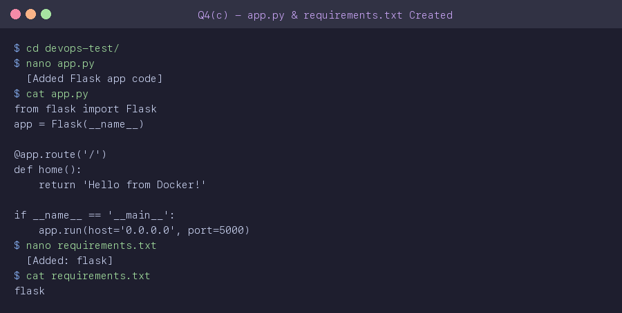

---

### Task 4d — Write the `Dockerfile`

**Dockerfile created inside `devops-test/`:**

```dockerfile
FROM python:3.14-slim

WORKDIR /myapp

COPY requirements.txt .
RUN pip install -r requirements.txt

COPY app.py .

CMD ["python", "app.py"]
```

- Base image: `python:3.14-slim`  
- Working directory: `/myapp`  
- Installs Flask from `requirements.txt`  
- Copies app code and starts it with `python app.py`

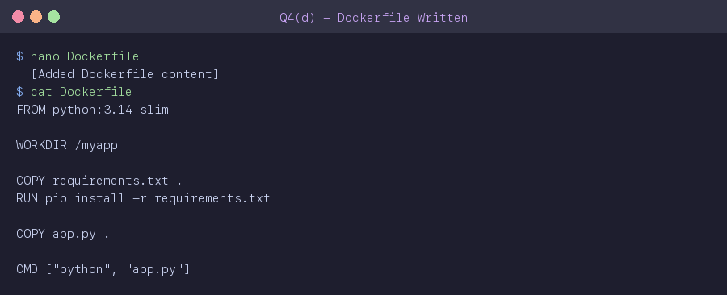

---

### Task 4e — Build `flask-test:1.0` Image

**Command used:**
```bash
docker build -t flask-test:1.0 .
```

Docker reads the `Dockerfile`, pulls the base image, installs dependencies, and packages everything into the `flask-test:1.0` image. Build completed in ~17 seconds.

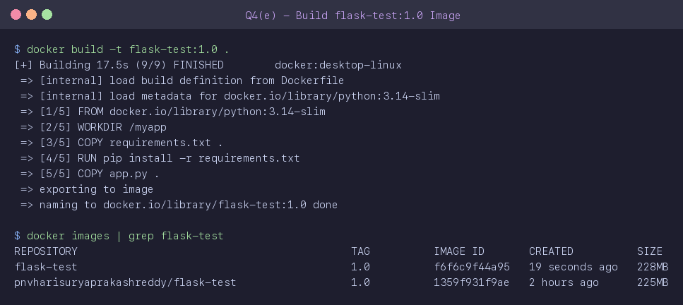

---

### Task 4f — Run Container & Verify in Browser

**Commands used:**
```bash
docker run -d --name flask-app -p 5001:5000 flask-test:1.0
curl http://localhost:5001
```

The Flask container was run on port 5001 (host) → 5000 (container). Verification:
```
Response: Hello from Docker!
```

✅ App is live and responding correctly.

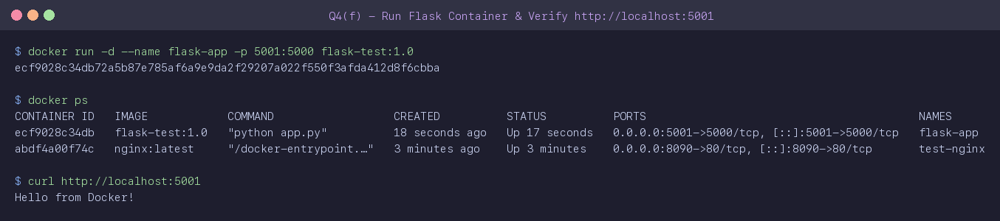

---

### Task 4g — Push Image to Docker Hub

**Commands used:**
```bash
docker tag flask-test:1.0 hsp6/flask-test:1.0
docker push hsp6/flask-test:1.0
```

The image was tagged with the Docker Hub username and pushed successfully.

🔗 **Docker Hub:** https://hub.docker.com/r/hsp6/flask-test/tags

**Digest:** `sha256:cba2b59e30c179c636f63186ae6d502a5c015edfd27a02ece90ef3b78b682477`

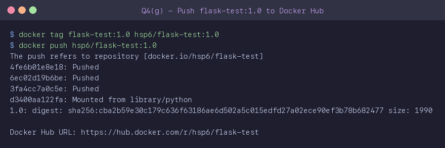

---

### Task 4h — Stop, Remove Container & Remove nginx Image

**Commands used:**
```bash
docker stop flask-app test-nginx
docker rm flask-app test-nginx
docker rmi nginx:latest
docker ps
```

Both running containers were stopped and removed. The `nginx:latest` image was also deleted from the local machine. `docker ps` confirms no containers are running.

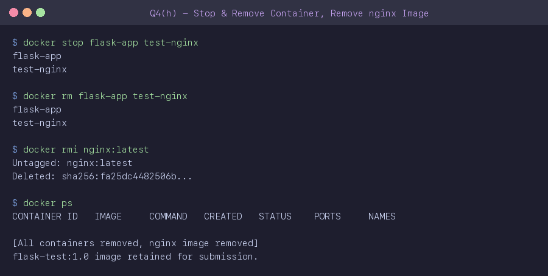

---

## 🔗 Important Links

| Resource | URL |
|----------|-----|
| 📦 **devops-test Repo** | https://github.com/pnvharisuryaprakashreddy/devops-test |
| 🔀 **Pull Request #2 (MERGED)** | https://github.com/pnvharisuryaprakashreddy/devops-test/pull/2 |
| 🐳 **Docker Hub Image** | https://hub.docker.com/r/hsp6/flask-test/tags |
| 📁 **This Submission Repo** | https://github.com/pnvharisuryaprakashreddy/devops-submission |

---

<div align="center">

Made with ❤️ by **Harisuryaprakash Reddy PNV**

</div>
